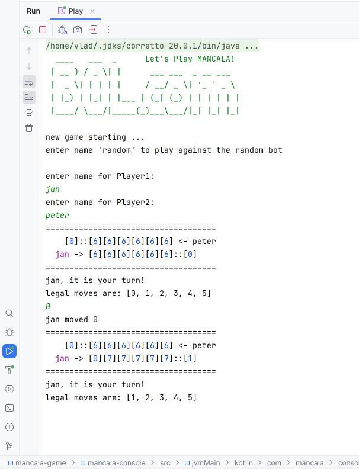
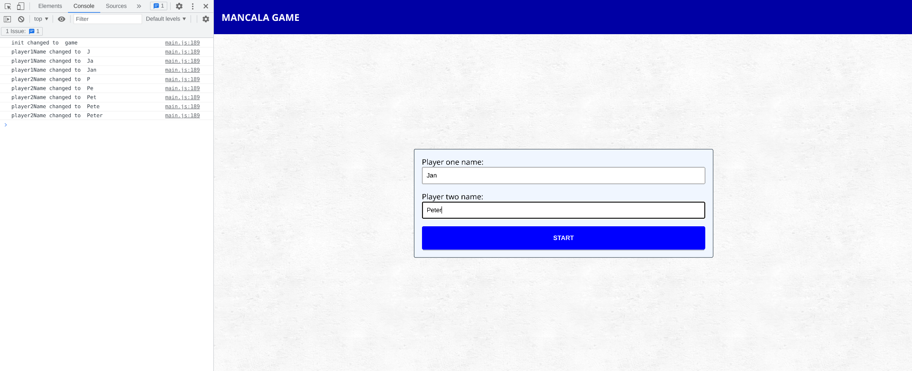
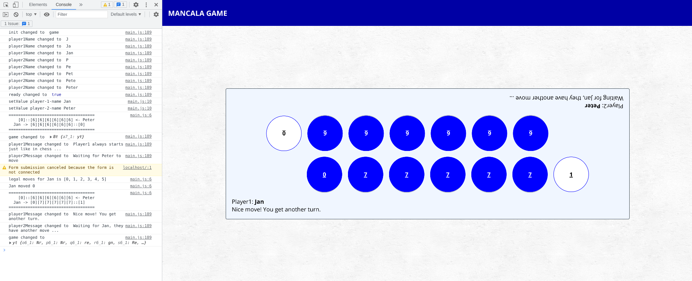

# Mancala
An implementation of the Mancala game using Kotlin Multiplatform on JDK20 with Gradle 8.1.1 and NPM 9.5.0

### Console Game

To run the console game, make sure you have JDK20 installed

First build the whole project from the root, then run the shadowJAR:

```
./gradlew build
java -jar mancala-console/build/libs/mancala-console-1.0.0-all.jar
```

It will then ask you for player names:

```
  ____   ___  _      Let's Play MANCALA!
 | __ ) / _ \| |      ___ ___  _ __ ___  
 |  _ \| | | | |     / __/ _ \| '_ ` _ \ 
 | |_) | |_| | |___ | (_| (_) | | | | | |
 |____/ \___/|_____(_)___\___/|_| |_| |_|
                                         
new game starting ...
enter name 'random' to play against the random bot

enter name for Player1:
```

Here you can enter "random" to play against a bot that just randomly picks a move or you can 
enter a name for a human player

```
enter name for Player1:
jan
enter name for Player2:
random
======================================
     [0]::[6][6][6][6][6][6] <- random
   jan -> [6][6][6][6][6][6]::[0]
======================================
jan, it is your turn!
legal moves are: [0, 1, 2, 3, 4, 5]
0
jan moved 0
======================================
     [0]::[6][6][6][6][6][6] <- random
   jan -> [0][7][7][7][7][7]::[1]
======================================
jan, it is your turn!
legal moves are: [1, 2, 3, 4, 5]
1
jan moved 1
======================================
     [2]::[8][8][8][8][0][0] <- jan   
random -> [7][7][6][6][6][6]::[0]
======================================
random, it is your turn!
legal moves are: [0, 1, 2, 3, 4, 5]
random moved 4
======================================
     [1]::[7][0][6][6][7][7] <- random
   jan -> [1][1][9][9][8][8]::[2]
======================================
jan, it is your turn!
legal moves are: [0, 1, 2, 3, 4, 5]
```

More intelligent bots can be added to the mancala-robot package.



### Web Game

To run the web game, make sure you have JDK20 installed 
as well as NPM 9.5.0 and NODE 18.15

Once again, first build the whole project from the root

```
./gradlew build
```

Once the Kotlin code is built, you can go to the web project:
```
cd /mancala-web/web
```

From here you can either do the production build or just run it.
ESBuild will integrate the KotlinJS packages into the NPM project

Production build: 

```
./build.sh

up to date, audited 56 packages in 557ms

7 packages are looking for funding
  run `npm fund` for details

found 0 vulnerabilities

> mancala-web@1.0.0 build
> ./node_modules/.bin/rimraf dist && ./esbuild.config.build.js

  dist/main.js                                         77.9kb
  dist/french-stucco-MZYZWD6A.png                      70.7kb
  dist/mem5YaGs126MiZpBA-UN7rgOX-hpOqc-KEHG453F.woff2  17.2kb
  ...
  dist/css/index.css                                    8.8kb
  ...
  ...and 10 more output files...
```

Production build can then be found in dist/index-______.html which can be opened directly in a browser and enjoyed.

The game can also be run in development mode:

```
./run.sh 

up to date, audited 56 packages in 578ms

7 packages are looking for funding
  run `npm fund` for details

found 0 vulnerabilities

> mancala-web@1.0.0 start
> ./node_modules/.bin/concurrently --kill-others --names tsc,esbuild.config.start.js \"./esbuild.config.start.js\"
```

Open http://localhost:7777/ in your browser and start the game by entering some names:



Hit the START button:



The bot mode is not enabled for the web version.

You can also directly interact with the `game` state from the browser console typing:

```
game.ready
game.move(0)
game.player1Turn
game.player1Cups
game.player1ScoringCup
game.player2Turn
game.player2Cups
game.player2ScoringCup
```

Note that this is for debugging purposes only